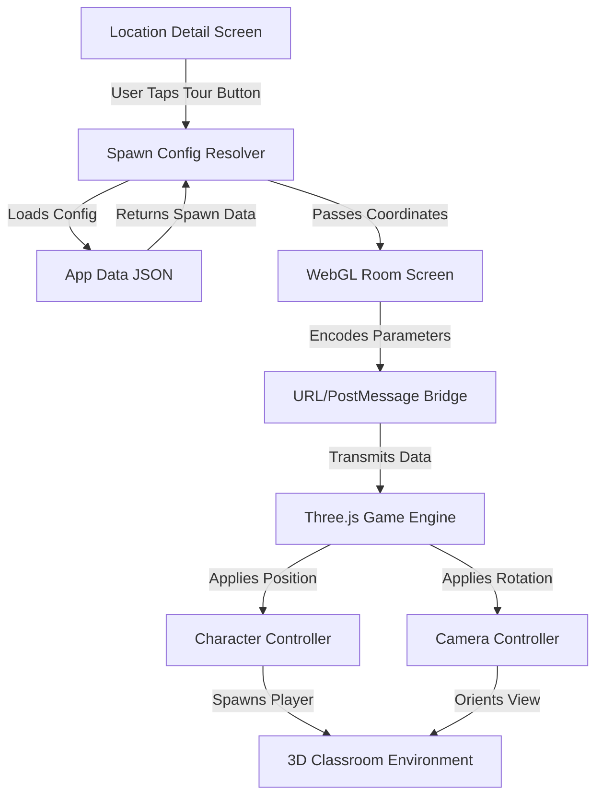

# Design Document

## Overview

The Dynamic 3D Location Spawn System is a sophisticated coordinate management architecture that enables contextually-aware player positioning across all campus locations in the virtual tour application. By extending the existing data infrastructure with location-specific spawn configurations, the system provides seamless integration between Flutter's UI layer and the Three.js game engine, ensuring each of the 10 campus locations offers a unique and immersive 3D experience.

The design leverages the existing WebGL infrastructure while introducing a flexible, JSON-based configuration system that allows non-technical stakeholders to adjust spawn positions without code modifications. The architecture prioritizes performance, maintainability, and extensibility while maintaining backward compatibility with the current panorama and WebGL systems.

## Architecture

### System Components



### Data Flow Architecture

1. **Configuration Loading Phase** (App Startup)
   - AppConstants.initialize() loads app_data.json
   - Spawn configurations parsed into memory-cached Map<String, SpawnConfig>
   - Validation ensures all coordinates are within safe bounds

2. **User Interaction Phase** (Tour Button Tap)
   - LocationDetailScreen retrieves spawn config for current location
   - SpawnConfig serialized into URL parameters or JSON payload
   - Navigation to WebGLRoomScreen with spawn data

3. **Engine Initialization Phase** (Three.js Startup)
   - WebGL engine parses spawn parameters from URL or postMessage
   - Character system applies spawn coordinates to player entity
   - Camera system applies orientation to initial view
   - First frame renders with player at correct position

### Component Responsibilities

**Flutter Layer:**
- **AppConstants**: Manages spawn configuration loading and caching
- **LocationDetailScreen**: Resolves spawn config for current location
- **WebGLRoomScreen**: Encodes and transmits spawn data to JavaScript
- **SpawnConfig Model**: Type-safe Dart class for spawn data

**JavaScript Layer:**
- **SpawnManager**: Parses and validates incoming spawn coordinates
- **CharacterSystem**: Applies spawn position to player entity
- **CameraController**: Applies initial camera orientation
- **CoordinateValidator**: Ensures coordinates are within safe bounds

## Components and Interfaces

### 1. SpawnConfig Data Model (Dart)

```dart
class SpawnConfig {
  final Vector3 position;
  final Vector3 rotation;
  final String locationName;
  final String? description;
  final double scaleFactor;
  final String environmentType;
  
  const SpawnConfig({
    required this.position,
    required this.rotation,
    required this.locationName,
    this.description,
    this.scaleFactor = 1.0,
    this.environmentType = 'classroom',
  });
  
  factory SpawnConfig.fromJson(Map<String, dynamic> json) {
    return SpawnConfig(
      position: Vector3(
        json['position']['x']?.toDouble() ?? 0.0,
        json['position']['y']?.toDouble() ?? 1.6,
        json['position']['z']?.toDouble() ?? 0.0,
      ),
      rotation: Vector3(
        json['rotation']['pitch']?.toDouble() ?? 0.0,
        json['rotation']['yaw']?.toDouble() ?? 0.0,
        json['rotation']['roll']?.toDouble() ?? 0.0,
      ),
      locationName: json['locationName'] ?? '',
      description: json['description'],
      scaleFactor: json['scaleFactor']?.toDouble() ?? 1.0,
      environmentType: json['environmentType'] ?? 'classroom',
    );
  }
  
  Map<String, dynamic> toJson() {
    return {
      'position': {'x': position.x, 'y': position.y, 'z': position.z},
      'rotation': {'pitch': rotation.x, 'yaw': rotation.y, 'roll': rotation.z},
      'locationName': locationName,
      'description': description,
      'scaleFactor': scaleFactor,
      'environmentType': environmentType,
    };
  }
  
  String toUrlParams() {
    return 'spawnX=${position.x}&spawnY=${position.y}&spawnZ=${position.z}'
           '&pitch=${rotation.x}&yaw=${rotation.y}&roll=${rotation.z}';
  }
}

class Vector3 {
  final double x;
  final double y;
  final double z;
  
  const Vector3(this.x, this.y, this.z);
}
```

### 2. AppConstants Extension (Dart)

```dart
class AppConstants {
  // Existing fields...
  static late Map<String, SpawnConfig> locationSpawnConfigs;
  static late SpawnConfig defaultSpawnConfig;
  
  static Future<void> initialize() async {
    // Existing initialization...
    
    // Load spawn configurations
    final Map<String, dynamic> spawnConfigsJson = 
        json['locationSpawnConfigs'] ?? {};
    
    locationSpawnConfigs = spawnConfigsJson.map((key, value) {
      return MapEntry(key, SpawnConfig.fromJson(value));
    });
    
    // Set default spawn config
    defaultSpawnConfig = SpawnConfig(
      position: Vector3(0, 1.6, 5),
      rotation: Vector3(0, 0, 0),
      locationName: 'default',
      description: 'Default classroom entrance',
    );
    
    AppLogger.info('Spawn configurations loaded', 
      component: 'AppConstants',
      metadata: {'count': locationSpawnConfigs.length});
  }
  
  static SpawnConfig getSpawnConfigFor(String locationName) {
    final config = locationSpawnConfigs[locationName];
    if (config == null) {
      AppLogger.warning('No spawn config for $locationName, using default',
        component: 'AppConstants');
      return defaultSpawnConfig;
    }
    return config;
  }
  
  static bool hasSpawnConfig(String locationName) {
    return locationSpawnConfigs.containsKey(locationName);
  }
}
```

### 3. LocationDetailScreen Integration (Dart)

```dart
void _openTour() {
  if (!mounted) return;

  // Get spawn configuration for this location
  final spawnConfig = AppConstants.getSpawnConfigFor(widget.locationData.name);
  
  // Log spawn configuration for debugging
  AppLogger.info('Opening tour with spawn config',
    component: 'LocationDetailScreen',
    metadata: {
      'location': widget.locationData.name,
      'spawnX': spawnConfig.position.x,
      'spawnY': spawnConfig.position.y,
      'spawnZ': spawnConfig.position.z,
    });

  // Navigate to WebGL room with spawn configuration
  Navigator.of(context, rootNavigator: false).push(
    PageRouteBuilder(
      pageBuilder: (_, __, ___) => WebGLRoomScreen(
        title: widget.locationData.name,
        url: 'classroom',
        spawnConfig: spawnConfig, // Pass spawn config
      ),
      transitionsBuilder: (_, animation, __, child) =>
          FadeTransition(opacity: animation, child: child),
      transitionDuration: const Duration(milliseconds: 400),
      settings: RouteSettings(
        name: '/webgl/${widget.locationData.name}',
        arguments: {
          'url': 'classroom',
          'title': widget.locationData.name,
          'spawnConfig': spawnConfig.toJson(),
        },
      ),
    ),
  );
}
```

### 4. WebGLRoomScreen Enhancement (Dart)

```dart
class WebGLRoomScreen extends StatefulWidget {
  final String title;
  final String url;
  final SpawnConfig? spawnConfig;

  const WebGLRoomScreen({
    super.key,
    required this.title,
    required this.url,
    this.spawnConfig,
  });
  
  @override
  State<WebGLRoomScreen> createState() => _WebGLRoomScreenState();
}

class _WebGLRoomScreenState extends State<WebGLRoomScreen> {
  void _sendSpawnConfigToWebGL() {
    if (widget.spawnConfig == null) return;
    
    final spawnData = jsonEncode(widget.spawnConfig!.toJson());
    
    // Send via postMessage to iframe
    final message = jsonEncode({
      'type': 'SPAWN_CONFIG',
      'data': widget.spawnConfig!.toJson(),
    });
    
    // Use platform channel or JavaScript interop
    _webViewController?.runJavaScript('''
      window.postMessage($message, '*');
    ''');
    
    AppLogger.info('Spawn config sent to WebGL',
      component: 'WebGLRoomScreen',
      metadata: {'location': widget.title});
  }
}
```

### 5. SpawnManager (JavaScript)

```javascript
// web/threejs/src/core/SpawnManager.js

export class SpawnManager {
  constructor() {
    this.defaultSpawnConfig = {
      position: { x: 0, y: 1.6, z: 5 },
      rotation: { pitch: 0, yaw: 0, roll: 0 },
      locationName: 'default',
      scaleFactor: 1.0,
      environmentType: 'classroom'
    };
    
    this.currentSpawnConfig = null;
    this.setupMessageListener();
  }
  
  setupMessageListener() {
    window.addEventListener('message', (event) => {
      if (event.data.type === 'SPAWN_CONFIG') {
        this.currentSpawnConfig = event.data.data;
        console.log('[SpawnManager] Received spawn config:', this.currentSpawnConfig);
      }
    });
  }
  
  parseUrlParams() {
    const params = new URLSearchParams(window.location.search);
    
    if (params.has('spawnX')) {
      return {
        position: {
          x: parseFloat(params.get('spawnX')) || 0,
          y: parseFloat(params.get('spawnY')) || 1.6,
          z: parseFloat(params.get('spawnZ')) || 5
        },
        rotation: {
          pitch: parseFloat(params.get('pitch')) || 0,
          yaw: parseFloat(params.get('yaw')) || 0,
          roll: parseFloat(params.get('roll')) || 0
        },
        locationName: params.get('location') || 'unknown',
        scaleFactor: parseFloat(params.get('scale')) || 1.0,
        environmentType: params.get('env') || 'classroom'
      };
    }
    
    return null;
  }
  
  getSpawnConfig() {
    // Priority: postMessage > URL params > default
    if (this.currentSpawnConfig) {
      return this.validateAndClamp(this.currentSpawnConfig);
    }
    
    const urlConfig = this.parseUrlParams();
    if (urlConfig) {
      return this.validateAndClamp(urlConfig);
    }
    
    console.warn('[SpawnManager] No spawn config found, using default');
    return this.defaultSpawnConfig;
  }
  
  validateAndClamp(config) {
    // Clamp Y position to keep player above ground
    const minY = 0.5;
    const maxY = 10.0;
    config.position.y = Math.max(minY, Math.min(maxY, config.position.y));
    
    // Clamp X and Z to reasonable bounds
    const maxXZ = 50.0;
    config.position.x = Math.max(-maxXZ, Math.min(maxXZ, config.position.x));
    config.position.z = Math.max(-maxXZ, Math.min(maxXZ, config.position.z));
    
    // Normalize rotation angles to [-π, π]
    config.rotation.pitch = this.normalizeAngle(config.rotation.pitch);
    config.rotation.yaw = this.normalizeAngle(config.rotation.yaw);
    config.rotation.roll = this.normalizeAngle(config.rotation.roll);
    
    return config;
  }
  
  normalizeAngle(angle) {
    while (angle > Math.PI) angle -= 2 * Math.PI;
    while (angle < -Math.PI) angle += 2 * Math.PI;
    return angle;
  }
}
```

### 6. CharacterSystem Integration (JavaScript)

```javascript
// web/threejs/src/core/CharacterSystem.js

import { SpawnManager } from './SpawnManager.js';

export class CharacterSystem {
  constructor(scene, camera) {
    this.scene = scene;
    this.camera = camera;
    this.spawnManager = new SpawnManager();
    this.player = null;
  }
  
  async initialize() {
    // Get spawn configuration
    const spawnConfig = this.spawnManager.getSpawnConfig();
    
    console.log('[CharacterSystem] Initializing with spawn config:', spawnConfig);
    
    // Create player entity
    this.player = await this.createPlayer();
    
    // Apply spawn position
    this.applySpawnPosition(spawnConfig);
    
    // Apply camera orientation
    this.applySpawnRotation(spawnConfig);
    
    console.log('[CharacterSystem] Player spawned at:', 
      this.player.position.toArray());
  }
  
  applySpawnPosition(config) {
    if (!this.player) return;
    
    this.player.position.set(
      config.position.x,
      config.position.y,
      config.position.z
    );
    
    // Update camera to follow player
    this.camera.position.copy(this.player.position);
    this.camera.position.y += 1.6; // Eye height offset
  }
  
  applySpawnRotation(config) {
    if (!this.camera) return;
    
    // Apply rotation in Euler angles
    this.camera.rotation.set(
      config.rotation.pitch,
      config.rotation.yaw,
      config.rotation.roll,
      'YXZ' // Yaw-Pitch-Roll order
    );
  }
  
  async createPlayer() {
    // Existing player creation logic...
  }
}
```

## Data Models

### JSON Schema for locationSpawnConfigs

```json
{
  "locationSpawnConfigs": {
    "Library": {
      "position": { "x": -8.5, "y": 1.6, "z": 12.0 },
      "rotation": { "pitch": 0.0, "yaw": -0.785, "roll": 0.0 },
      "locationName": "Library",
      "description": "Spawn near the library entrance with view of bookshelves",
      "scaleFactor": 1.0,
      "environmentType": "classroom"
    },
    "Play Area": {
      "position": { "x": 15.0, "y": 1.6, "z": -5.0 },
      "rotation": { "pitch": 0.0, "yaw": 2.356, "roll": 0.0 },
      "locationName": "Play Area",
      "description": "Spawn in open area with view of recreational space",
      "scaleFactor": 1.0,
      "environmentType": "classroom"
    },
    "Auditorium": {
      "position": { "x": 0.0, "y": 1.6, "z": -15.0 },
      "rotation": { "pitch": 0.0, "yaw": 0.0, "roll": 0.0 },
      "locationName": "Auditorium",
      "description": "Spawn at back of auditorium facing stage",
      "scaleFactor": 1.0,
      "environmentType": "classroom"
    },
    "Class Rooms": {
      "position": { "x": 0.0, "y": 1.6, "z": 5.0 },
      "rotation": { "pitch": 0.0, "yaw": 0.0, "roll": 0.0 },
      "locationName": "Class Rooms",
      "description": "Default classroom entrance spawn",
      "scaleFactor": 1.0,
      "environmentType": "classroom"
    },
    "Amphitheater": {
      "position": { "x": -12.0, "y": 1.6, "z": -8.0 },
      "rotation": { "pitch": -0.262, "yaw": 0.524, "roll": 0.0 },
      "locationName": "Amphitheater",
      "description": "Spawn on elevated tier with downward view",
      "scaleFactor": 1.0,
      "environmentType": "classroom"
    },
    "Cafeteria": {
      "position": { "x": 10.0, "y": 1.6, "z": 8.0 },
      "rotation": { "pitch": 0.0, "yaw": -1.571, "roll": 0.0 },
      "locationName": "Cafeteria",
      "description": "Spawn near dining area with side view",
      "scaleFactor": 1.0,
      "environmentType": "classroom"
    },
    "Common Room": {
      "position": { "x": -5.0, "y": 1.6, "z": 0.0 },
      "rotation": { "pitch": 0.0, "yaw": 1.571, "roll": 0.0 },
      "locationName": "Common Room",
      "description": "Spawn in center of common area",
      "scaleFactor": 1.0,
      "environmentType": "classroom"
    },
    "Playground": {
      "position": { "x": 18.0, "y": 1.6, "z": 10.0 },
      "rotation": { "pitch": 0.0, "yaw": -2.356, "roll": 0.0 },
      "locationName": "Playground",
      "description": "Spawn at playground corner with diagonal view",
      "scaleFactor": 1.0,
      "environmentType": "classroom"
    },
    "Swimming Pool": {
      "position": { "x": -15.0, "y": 1.6, "z": 15.0 },
      "rotation": { "pitch": 0.0, "yaw": 0.785, "roll": 0.0 },
      "locationName": "Swimming Pool",
      "description": "Spawn at pool deck with angled view",
      "scaleFactor": 1.0,
      "environmentType": "classroom"
    },
    "Webinar Room": {
      "position": { "x": 5.0, "y": 1.6, "z": -10.0 },
      "rotation": { "pitch": 0.0, "yaw": 3.142, "roll": 0.0 },
      "locationName": "Webinar Room",
      "description": "Spawn facing presentation screen",
      "scaleFactor": 1.0,
      "environmentType": "classroom"
    }
  }
}
```

### Coordinate System Reference

```
Three.js Right-Handed Coordinate System:
- X-axis: Positive = Right, Negative = Left
- Y-axis: Positive = Up, Negative = Down
- Z-axis: Positive = Forward (toward camera), Negative = Backward

Rotation Conventions:
- Pitch: Rotation around X-axis (looking up/down)
- Yaw: Rotation around Y-axis (looking left/right)
- Roll: Rotation around Z-axis (tilting head)

Angles in radians:
- 0 rad = 0°
- π/4 rad = 45°
- π/2 rad = 90°
- π rad = 180°
- 2π rad = 360°
```

## Correctness Properties

*A property is a characteristic or behavior that should hold true across all valid executions of a system—essentially, a formal statement about what the system should do. Properties serve as the bridge between human-readable specifications and machine-verifiable correctness guarantees.*

### Property 1: Spawn Configuration Completeness

*For any* location in the 10 campus locations, there should exist a valid spawn configuration in the locationSpawnConfigs map or the system should successfully fall back to the default configuration.

**Validates: Requirements 1.3, 10.2**

### Property 2: Coordinate Bounds Safety

*For any* spawn configuration loaded by the system, the Y-coordinate should be greater than or equal to 0.5 (above ground) and less than or equal to 10.0 (reasonable ceiling height).

**Validates: Requirements 1.4, 4.4**

### Property 3: Configuration Parsing Round-Trip

*For any* valid SpawnConfig object, serializing to JSON and then deserializing should produce an equivalent SpawnConfig with the same position and rotation values (within floating-point precision).

**Validates: Requirements 2.4, 3.4**

### Property 4: Location Name Mapping Consistency

*For any* location card title used in the UI, calling AppConstants.getSpawnConfigFor() should return a SpawnConfig whose locationName field matches the input title or returns the default configuration.

**Validates: Requirements 1.1, 3.1**

### Property 5: Angle Normalization Idempotence

*For any* rotation angle value, applying the normalizeAngle() function twice should produce the same result as applying it once (idempotent operation).

**Validates: Requirements 4.4, 5.3**

### Property 6: WebGL Engine Spawn Application

*For any* spawn configuration passed to the CharacterSystem, after initialization completes, the player entity's position should match the spawn configuration's position coordinates (within 0.01 units tolerance).

**Validates: Requirements 4.2, 4.5**

### Property 7: Camera Orientation Application

*For any* spawn configuration with rotation values, after the camera controller applies the orientation, the camera's Euler angles should match the spawn configuration's pitch, yaw, and roll values (within 0.01 radians tolerance).

**Validates: Requirements 4.3, 6.1, 6.2**

### Property 8: Fallback Configuration Validity

*For any* location without a spawn configuration, the system should return the default spawn configuration which has valid coordinates (Y >= 0.5, all coordinates within [-50, 50] range).

**Validates: Requirements 1.3, 10.1, 10.2**

### Property 9: URL Parameter Encoding Completeness

*For any* SpawnConfig object, calling toUrlParams() should produce a URL query string that contains all six coordinate values (x, y, z, pitch, yaw, roll) as parseable numeric parameters.

**Validates: Requirements 3.2, 3.4**

### Property 10: Configuration Loading Performance

*For any* application startup sequence, loading and parsing all spawn configurations from app_data.json should complete within 100ms on standard mobile devices.

**Validates: Requirements 9.1, 9.3**

## Error Handling

### Error Categories and Responses

1. **Missing Spawn Configuration**
   - Error: Location has no entry in locationSpawnConfigs
   - Response: Log warning, return default spawn configuration
   - User Impact: None (seamless fallback)

2. **Malformed JSON Data**
   - Error: Spawn configuration JSON is invalid or missing required fields
   - Response: Log error with details, skip malformed entry, use default
   - User Impact: None (graceful degradation)

3. **Out-of-Bounds Coordinates**
   - Error: Spawn coordinates exceed safe boundaries
   - Response: Clamp values to valid ranges, log warning
   - User Impact: Player spawns at boundary instead of invalid position

4. **WebGL Communication Failure**
   - Error: postMessage or URL parameters fail to reach JavaScript
   - Response: JavaScript falls back to default spawn, logs error
   - User Impact: Player spawns at default location instead of custom position

5. **Coordinate System Mismatch**
   - Error: Coordinates interpreted in wrong coordinate system
   - Response: Validation detects unreasonable values, applies correction
   - User Impact: Spawn position adjusted to valid location

### Error Logging Strategy

```dart
// Flutter error logging
AppLogger.error('Failed to load spawn config',
  component: 'AppConstants',
  error: e,
  metadata: {
    'location': locationName,
    'operation': 'getSpawnConfigFor',
    'fallback': 'using default config'
  });
```

```javascript
// JavaScript error logging
console.error('[SpawnManager] Invalid spawn coordinates:', {
  received: config,
  clamped: clampedConfig,
  reason: 'Y coordinate below ground level'
});
```

## Testing Strategy

### Unit Tests (Dart)

1. **SpawnConfig Serialization Tests**
   - Test JSON parsing from valid configuration
   - Test JSON serialization round-trip
   - Test URL parameter encoding
   - Test handling of missing optional fields

2. **AppConstants Spawn Loading Tests**
   - Test loading all 10 location configurations
   - Test fallback to default when location missing
   - Test validation of coordinate bounds
   - Test caching behavior

3. **Coordinate Validation Tests**
   - Test Y-coordinate clamping to valid range
   - Test X/Z coordinate boundary enforcement
   - Test angle normalization to [-π, π]

### Property-Based Tests (Dart)

1. **Property Test: Configuration Round-Trip**
   - Generate random SpawnConfig objects
   - Serialize to JSON and deserialize
   - Verify all fields match original values

2. **Property Test: Coordinate Clamping**
   - Generate random coordinate values (including out-of-bounds)
   - Apply validation and clamping
   - Verify results are within valid ranges

3. **Property Test: Angle Normalization**
   - Generate random angle values
   - Apply normalization twice
   - Verify idempotence (f(x) = f(f(x)))

### Integration Tests (JavaScript)

1. **SpawnManager Integration Tests**
   - Test receiving spawn config via postMessage
   - Test parsing spawn config from URL parameters
   - Test fallback to default configuration
   - Test coordinate validation and clamping

2. **CharacterSystem Spawn Tests**
   - Test player entity spawns at correct position
   - Test camera orientation matches spawn rotation
   - Test spawn completes before first frame render

### End-to-End Tests

1. **Location Tour Flow Tests**
   - For each of the 10 locations:
     - Tap "Start Tour" button
     - Verify WebGL loads with correct spawn position
     - Verify player can move from spawn position
     - Verify camera orientation is correct

2. **Error Handling Tests**
   - Test tour with missing spawn configuration
   - Test tour with malformed spawn data
   - Test tour with out-of-bounds coordinates
   - Verify graceful fallbacks in all cases

### Test Configuration

- **Property test iterations**: Minimum 100 per test
- **Test framework**: Flutter test for Dart, Jest for JavaScript
- **Coverage target**: 90% for spawn-related code
- **Performance benchmarks**: Spawn loading < 100ms, spawn application < 16ms

### Test Tags

All property-based tests will be tagged with:
```dart
// Feature: dynamic-3d-location-spawn-system, Property 3: Configuration Parsing Round-Trip
test('spawn config serialization round-trip', () { ... });
```

```javascript
// Feature: dynamic-3d-location-spawn-system, Property 6: WebGL Engine Spawn Application
describe('CharacterSystem spawn application', () => { ... });
```
