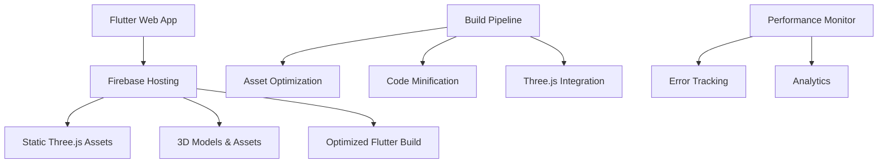
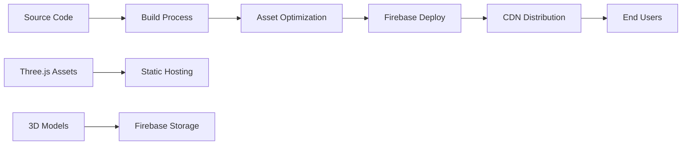

# Firebase Deployment & Project Optimization Design

## Overview

This design outlines a comprehensive approach to clean up the Flutter web project, optimize performance, and deploy the complete application with Three.js integration to Firebase Hosting. The solution eliminates redundant files, optimizes the build process, and ensures reliable 3D classroom functionality in production.

## Architecture

### High-Level Architecture



### Deployment Architecture



## Components and Interfaces

### 1. Project Cleanup Manager

**Purpose**: Identifies and removes redundant files, unused code, and temporary assets.

**Key Functions**:
- Scan project for unused files
- Remove test files not needed in production
- Consolidate Three.js implementations
- Clean up documentation and temporary files

**Files to Remove**:
```
- test_classroom_integration.html (test file)
- test_model_access.html (test file)  
- web/three_viewer.html (redundant, use classroom-viewer-working.html)
- Unused spec files and documentation
- Redundant Three.js server files
- Build artifacts and cache files
```

### 2. Three.js Static Integration

**Purpose**: Convert Three.js from localhost server dependency to static hosting.

**Implementation Strategy**:
```javascript
// Current: Uses localhost:3000 server
iframe.src = 'http://localhost:3000/?room=${url}'

// New: Uses static files
iframe.src = './threejs/classroom-viewer-working.html'
```

**Asset Structure**:
```
web/
├── threejs/
│   ├── classroom-viewer-working.html (main viewer)
│   ├── assets/
│   │   └── models/
│   │       └── classroom.glb
│   └── libs/ (Three.js libraries)
└── assets/
    └── models/
        └── classroom.glb (backup location)
```

### 3. Firebase Hosting Configuration

**Purpose**: Configure Firebase to serve both Flutter and Three.js content efficiently.

**Firebase Configuration**:
```json
{
  "hosting": {
    "public": "build/web",
    "ignore": ["firebase.json", "**/.*", "**/node_modules/**"],
    "cleanUrls": true,
    "trailingSlash": false,
    "headers": [
      {
        "source": "**/*.glb",
        "headers": [
          {"key": "Content-Type", "value": "application/octet-stream"},
          {"key": "Cache-Control", "value": "public, max-age=31536000"}
        ]
      },
      {
        "source": "**/*.js",
        "headers": [
          {"key": "Cache-Control", "value": "public, max-age=31536000"}
        ]
      }
    ],
    "rewrites": [
      {
        "source": "!/threejs/**",
        "destination": "/index.html"
      }
    ]
  }
}
```

### 4. Build Process Optimizer

**Purpose**: Optimize the Flutter build process for production deployment.

**Build Commands**:
```bash
# Clean previous builds
flutter clean

# Build with optimizations
flutter build web --release --web-renderer canvaskit --dart-define=FLUTTER_WEB_USE_SKIA=true

# Copy Three.js assets to build
cp -r web/threejs build/web/

# Deploy to Firebase
firebase deploy --only hosting
```

### 5. Performance Optimization Layer

**Purpose**: Implement performance optimizations for faster loading and better user experience.

**Optimizations**:

1. **Asset Compression**:
   - Enable gzip/brotli compression
   - Optimize 3D model files
   - Compress images and textures

2. **Code Splitting**:
   - Lazy load 3D components
   - Split Flutter bundles
   - Progressive loading for large assets

3. **Caching Strategy**:
   - Long-term caching for static assets
   - Service worker for offline support
   - CDN integration for global distribution

### 6. Mobile Performance Fixes

**Purpose**: Fix mobile-specific issues and optimize for mobile devices.

**Mobile WebGL Service Fix**:
```dart
// Fixed mobile service registration
ui.platformViewRegistry.registerViewFactory(
  'mobile-webgl-viewer-stable', // Use stable view type
  (int viewId) => createMobileIframe()
);
```

**Mobile Optimizations**:
- Reduced texture quality for mobile
- Simplified lighting for performance
- Touch-optimized controls
- Memory management improvements

## Data Models

### Build Configuration Model

```dart
class BuildConfiguration {
  final bool isProduction;
  final bool enableOptimizations;
  final String targetPlatform;
  final Map<String, String> assetPaths;
  final List<String> excludedFiles;
}
```

### Asset Management Model

```dart
class AssetManager {
  final String baseUrl;
  final Map<String, String> assetPaths;
  final CacheStrategy cacheStrategy;
  
  String getAssetUrl(String assetPath);
  Future<void> preloadAssets(List<String> assets);
}
```

## Correctness Properties

*A property is a characteristic or behavior that should hold true across all valid executions of a system-essentially, a formal statement about what the system should do. Properties serve as the bridge between human-readable specifications and machine-verifiable correctness guarantees.*

### Property 1: Asset Accessibility
*For any* deployed asset path, accessing the asset should return a successful response with correct MIME type
**Validates: Requirements 2.3, 6.1**

### Property 2: Build Completeness  
*For any* production build, all required Three.js assets should be included in the build output
**Validates: Requirements 3.1, 7.1**

### Property 3: Mobile Compatibility
*For any* mobile device accessing the application, the WebGL service should initialize without registration errors
**Validates: Requirements 5.1, 5.2**

### Property 4: Performance Optimization
*For any* asset served from Firebase, appropriate caching headers should be set for optimal performance
**Validates: Requirements 4.2, 6.2**

### Property 5: Error Handling Robustness
*For any* error condition (network, WebGL, model loading), the system should provide meaningful feedback and fallbacks
**Validates: Requirements 8.1, 8.3**

## Error Handling

### 1. Build Process Errors
- Missing asset files
- Compilation failures
- Deployment errors

### 2. Runtime Errors
- WebGL initialization failures
- Model loading errors
- Network connectivity issues

### 3. Mobile-Specific Errors
- Memory limitations
- WebGL context loss
- Touch control issues

## Testing Strategy

### Unit Tests
- Asset path resolution
- Build configuration validation
- Error handling mechanisms

### Integration Tests
- Firebase deployment pipeline
- Three.js asset loading
- Mobile WebGL service registration

### Performance Tests
- Loading time measurements
- Memory usage monitoring
- Mobile device compatibility

### Property-Based Tests
- Asset accessibility across different paths
- Build completeness verification
- Mobile compatibility validation

**Property Test Configuration**:
- Minimum 100 iterations per test
- Test across different device types
- Validate caching behavior
- Verify error handling paths

Each property test will reference its design document property using the format:
**Feature: firebase-deployment-optimization, Property {number}: {property_text}**