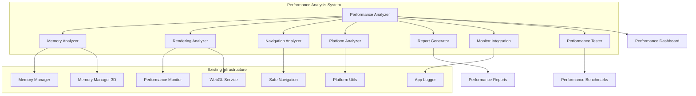

# Design Document

## Overview

This design document outlines a comprehensive performance analysis and optimization system for the Flutter Virtual Tour application. The system leverages the existing performance monitoring infrastructure including Performance_Monitor, Memory_Manager, Memory_Manager_3D, WebGL_Service, App_Logger, and Platform_Utils to provide deep insights into application performance and actionable optimization recommendations.

The design focuses on creating a unified performance analysis framework that can collect, analyze, and report on various performance metrics while providing specific optimization strategies for both mobile and desktop platforms.

## Architecture

The performance analysis system follows a modular architecture with specialized analyzers for different performance aspects:



## Components and Interfaces

### 1. Performance Analyzer (Core Component)

The main orchestrator that coordinates all performance analysis activities.

**Interface:**
```dart
abstract class PerformanceAnalyzer {
  Future<PerformanceReport> analyzeFullSystem();
  Future<MemoryAnalysisResult> analyzeMemoryUsage();
  Future<RenderingAnalysisResult> analyzeRenderingPerformance();
  Future<NavigationAnalysisResult> analyzeNavigationPerformance();
  Future<PlatformAnalysisResult> analyzePlatformSpecificPerformance();
  Future<void> startContinuousMonitoring();
  Future<void> stopContinuousMonitoring();
}
```

### 2. Memory Analyzer

Specialized component for analyzing memory usage patterns and optimization opportunities.

**Interface:**
```dart
abstract class MemoryAnalyzer {
  Future<MemoryUsageReport> analyzeCurrentMemoryUsage();
  Future<CacheEfficiencyReport> analyzeCacheEfficiency();
  Future<MemoryLeakReport> detectMemoryLeaks();
  Future<List<MemoryOptimizationRecommendation>> generateOptimizationRecommendations();
  Future<WebGLMemoryReport> analyzeWebGLMemoryUsage();
}
```

### 3. Rendering Analyzer

Component focused on rendering performance analysis across different rendering contexts.

**Interface:**
```dart
abstract class RenderingAnalyzer {
  Future<FPSAnalysisReport> analyzeFPSPerformance();
  Future<WebGLRenderingReport> analyzeWebGLRendering();
  Future<UIRenderingReport> analyzeUIRendering();
  Future<ImageLoadingReport> analyzeImageLoadingPerformance();
  Future<PanoramaRenderingReport> analyzePanoramaRendering();
}
```

### 4. Navigation Analyzer

Component for analyzing navigation performance and loading optimization effectiveness.

**Interface:**
```dart
abstract class NavigationAnalyzer {
  Future<NavigationPerformanceReport> analyzeNavigationTimes();
  Future<LoadingOptimizationReport> analyzeLoadingOptimizations();
  Future<ScreenTransitionReport> analyzeScreenTransitions();
  Future<PreloadingEfficiencyReport> analyzePreloadingEfficiency();
}
```

### 5. Platform Analyzer

Component for platform-specific performance analysis and optimization recommendations.

**Interface:**
```dart
abstract class PlatformAnalyzer {
  Future<MobilePerformanceReport> analyzeMobilePerformance();
  Future<DesktopPerformanceReport> analyzeDesktopPerformance();
  Future<CrossPlatformComparisonReport> comparePlatformPerformance();
  Future<DeviceCapabilityReport> analyzeDeviceCapabilities();
}
```

## Data Models

### Performance Metrics

```dart
class PerformanceMetrics {
  final double averageFPS;
  final double minFPS;
  final double maxFPS;
  final int totalMemoryUsage;
  final int peakMemoryUsage;
  final Duration averageNavigationTime;
  final Duration maxNavigationTime;
  final Map<String, double> componentPerformance;
  final DateTime timestamp;
  final String platform;
  final Map<String, dynamic> deviceInfo;
}
```

### Memory Analysis Data

```dart
class MemoryAnalysisData {
  final int totalMemoryUsed;
  final int totalMemoryLimit;
  final double memoryUsagePercent;
  final Map<String, int> memoryByComponent;
  final CacheStatistics textureCache;
  final CacheStatistics geometryCache;
  final CacheStatistics materialCache;
  final WebGLResourceStatistics webglResources;
  final List<MemoryPressureEvent> memoryPressureEvents;
}
```

### Rendering Performance Data

```dart
class RenderingPerformanceData {
  final FPSStatistics fpsStats;
  final WebGLPerformanceMetrics webglMetrics;
  final UIRenderingMetrics uiMetrics;
  final ImageLoadingMetrics imageMetrics;
  final PanoramaRenderingMetrics panoramaMetrics;
  final List<RenderingBottleneck> bottlenecks;
}
```

### Navigation Performance Data

```dart
class NavigationPerformanceData {
  final Map<String, Duration> screenLoadTimes;
  final Map<String, Duration> transitionTimes;
  final LoadingOptimizationMetrics loadingMetrics;
  final PreloadingEfficiencyMetrics preloadingMetrics;
  final List<NavigationError> navigationErrors;
}
```

## Correctness Properties

*A property is a characteristic or behavior that should hold true across all valid executions of a system-essentially, a formal statement about what the system should do. Properties serve as the bridge between human-readable specifications and machine-verifiable correctness guarantees.*

### Converting EARS to Properties

Based on the prework analysis, I'll convert the testable acceptance criteria into universally quantified properties. After reviewing all properties identified as testable, I can consolidate some related properties to eliminate redundancy while ensuring comprehensive coverage.

**Property Reflection:**
- Properties 1.1-1.5 can be combined into a comprehensive data collection property
- Properties 2.1-2.5 can be consolidated into memory analysis completeness properties  
- Properties 3.1-3.5 can be combined into rendering analysis completeness properties
- Properties 4.1-4.5 can be consolidated into navigation analysis completeness properties
- Properties 5.1-5.5 can be combined into platform analysis completeness properties
- Properties 6.1-6.5 can be consolidated into report generation completeness properties
- Properties 7.1-7.5 can be combined into monitoring integration completeness properties
- Properties 8.1-8.5 can be consolidated into performance testing completeness properties

**Property 1: Performance Data Collection Completeness**
*For any* performance analysis request, the Performance_Analyzer should collect data from all required sources (Performance_Monitor, Memory_Manager, Memory_Manager_3D, WebGL_Service, App_Logger) and return complete metrics for the requested analysis type
**Validates: Requirements 1.1, 1.2, 1.3, 1.4, 1.5**

**Property 2: Memory Analysis Completeness**
*For any* memory analysis request, the Memory_Analyzer should return comprehensive memory metrics including cache efficiency, resource utilization, memory pressure indicators, and platform-specific memory constraints
**Validates: Requirements 2.1, 2.2, 2.3, 2.4, 2.5**

**Property 3: Rendering Analysis Completeness**
*For any* rendering analysis request, the Rendering_Analyzer should return complete rendering metrics including FPS statistics, WebGL performance, UI rendering efficiency, image loading performance, and panorama rendering metrics
**Validates: Requirements 3.1, 3.2, 3.3, 3.4, 3.5**

**Property 4: Navigation Analysis Completeness**
*For any* navigation analysis request, the Navigation_Analyzer should return comprehensive navigation metrics including loading times, optimization effectiveness, transition performance, preloading efficiency, and error recovery metrics
**Validates: Requirements 4.1, 4.2, 4.3, 4.4, 4.5**

**Property 5: Platform Analysis Completeness**
*For any* platform analysis request, the Platform_Analyzer should return complete platform-specific metrics including mobile/desktop performance characteristics, cross-platform comparisons, device capability correlations, and optimization effectiveness
**Validates: Requirements 5.1, 5.2, 5.3, 5.4, 5.5**

**Property 6: Report Generation Completeness**
*For any* completed performance analysis, the Report_Generator should produce a comprehensive report containing all relevant metrics, identified bottlenecks, specific recommendations, and platform-targeted optimization suggestions
**Validates: Requirements 6.1, 6.2, 6.3, 6.4, 6.5**

**Property 7: Monitoring Integration Completeness**
*For any* enabled monitoring session, the Monitor_Integration should continuously collect metrics, detect threshold violations, track performance trends, identify regressions, and provide structured export data
**Validates: Requirements 7.1, 7.2, 7.3, 7.4, 7.5**

**Property 8: Performance Testing Completeness**
*For any* performance testing request, the Performance_Tester should execute standardized benchmarks, measure optimization effectiveness, perform regression testing, conduct load testing, and provide quantitative validation evidence
**Validates: Requirements 8.1, 8.2, 8.3, 8.4, 8.5**

## Error Handling

The performance analysis system implements comprehensive error handling to ensure robust operation:

### 1. Data Collection Errors
- **Missing Performance Monitor**: Gracefully handle cases where Performance_Monitor is not initialized
- **Memory Manager Unavailable**: Provide fallback metrics when memory managers are not accessible
- **WebGL Context Errors**: Handle WebGL context loss and recovery during analysis
- **Log Parsing Failures**: Continue analysis even if some log entries cannot be parsed

### 2. Analysis Errors
- **Insufficient Data**: Provide partial analysis results when complete data is unavailable
- **Platform Detection Failures**: Use safe defaults when platform detection fails
- **Memory Pressure During Analysis**: Implement analysis throttling during high memory usage
- **Concurrent Analysis Conflicts**: Prevent multiple simultaneous analyses from interfering

### 3. Reporting Errors
- **Report Generation Failures**: Provide basic metrics even if comprehensive reporting fails
- **Export Format Errors**: Support multiple export formats with fallbacks
- **Recommendation Engine Failures**: Provide generic recommendations when specific analysis fails

### 4. Monitoring Errors
- **Continuous Monitoring Interruptions**: Automatically restart monitoring after failures
- **Threshold Configuration Errors**: Use safe default thresholds when configuration is invalid
- **Data Export Failures**: Queue data for retry when export fails

## Testing Strategy

The performance analysis system uses a dual testing approach combining unit tests for specific functionality and property-based tests for comprehensive validation.

### Unit Testing Approach
Unit tests focus on:
- **Component Integration**: Testing integration with existing performance infrastructure
- **Data Collection Accuracy**: Verifying correct data retrieval from various sources
- **Error Handling**: Testing graceful degradation and error recovery
- **Platform-Specific Logic**: Testing mobile vs desktop behavior differences
- **Report Generation**: Testing report formatting and content accuracy

### Property-Based Testing Approach
Property-based tests validate universal properties using a minimum of 100 iterations per test:

- **Property Test 1**: Data Collection Completeness
  - Generate random analysis requests and verify complete data collection
  - **Feature: performance-analysis-optimization, Property 1**: Performance Data Collection Completeness

- **Property Test 2**: Memory Analysis Completeness  
  - Generate random memory states and verify comprehensive analysis
  - **Feature: performance-analysis-optimization, Property 2**: Memory Analysis Completeness

- **Property Test 3**: Rendering Analysis Completeness
  - Generate random rendering scenarios and verify complete analysis
  - **Feature: performance-analysis-optimization, Property 3**: Rendering Analysis Completeness

- **Property Test 4**: Navigation Analysis Completeness
  - Generate random navigation patterns and verify comprehensive analysis
  - **Feature: performance-analysis-optimization, Property 4**: Navigation Analysis Completeness

- **Property Test 5**: Platform Analysis Completeness
  - Generate random platform configurations and verify complete analysis
  - **Feature: performance-analysis-optimization, Property 5**: Platform Analysis Completeness

- **Property Test 6**: Report Generation Completeness
  - Generate random analysis results and verify comprehensive reporting
  - **Feature: performance-analysis-optimization, Property 6**: Report Generation Completeness

- **Property Test 7**: Monitoring Integration Completeness
  - Generate random monitoring scenarios and verify complete integration
  - **Feature: performance-analysis-optimization, Property 7**: Monitoring Integration Completeness

- **Property Test 8**: Performance Testing Completeness
  - Generate random testing scenarios and verify comprehensive testing
  - **Feature: performance-analysis-optimization, Property 8**: Performance Testing Completeness

### Testing Framework
The system will use Dart's built-in test framework with the `test` package for property-based testing, configured to run a minimum of 100 iterations per property test to ensure comprehensive coverage through randomization.

### Integration Testing
Integration tests will validate:
- **End-to-End Analysis Workflows**: Complete analysis from initiation to report generation
- **Real Performance Data**: Testing with actual app performance data
- **Cross-Platform Validation**: Testing on both mobile and desktop platforms
- **Performance Impact**: Ensuring analysis doesn't significantly impact app performance
- **Continuous Monitoring**: Long-running tests to validate monitoring stability