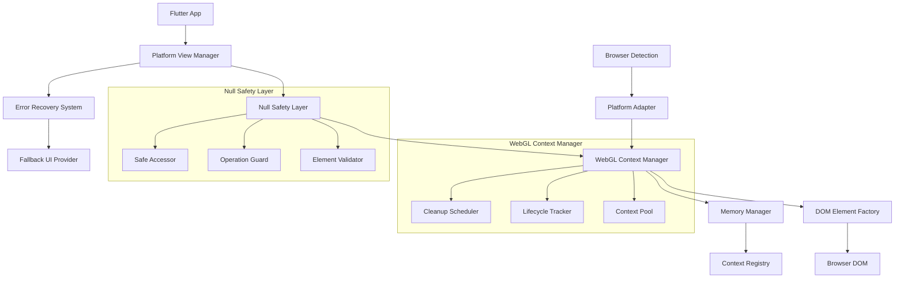
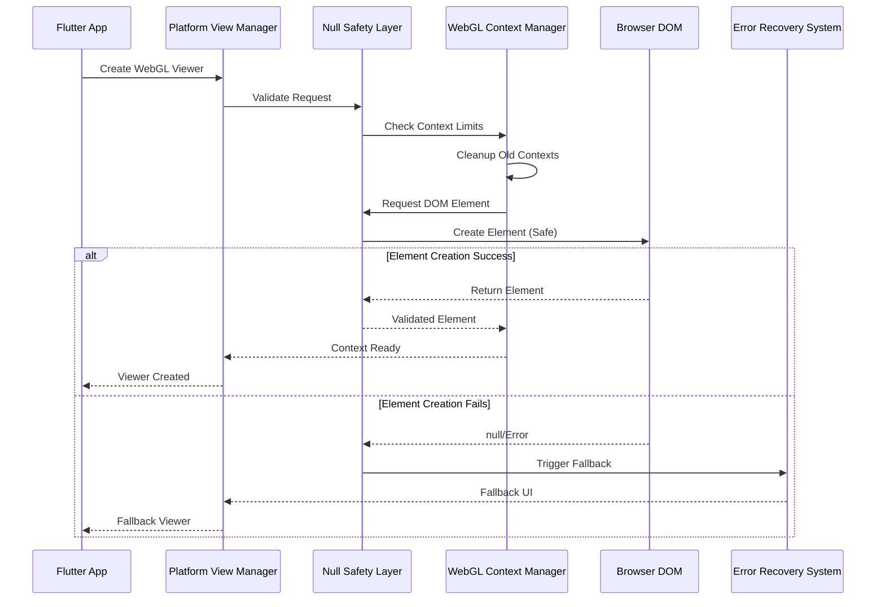
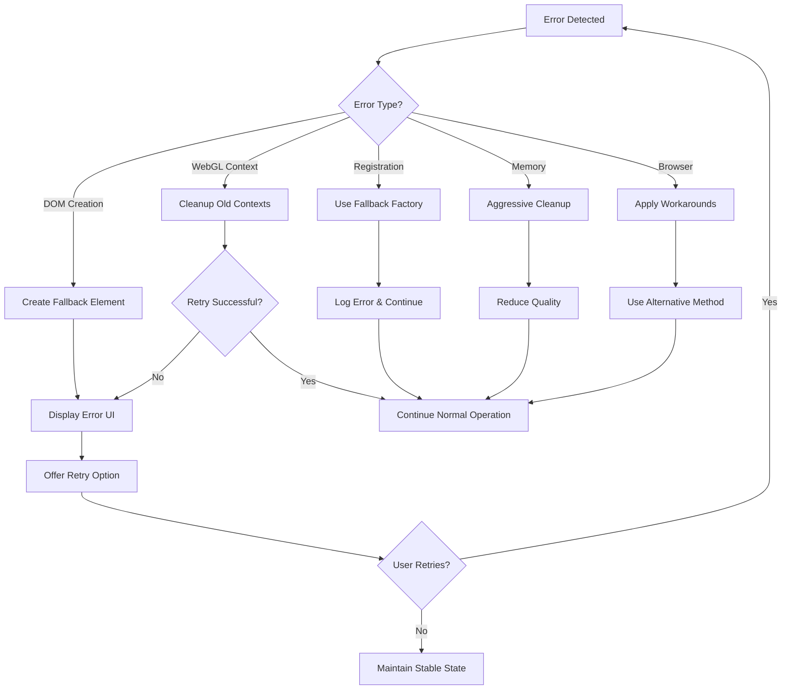

# Design Document: Web Platform Compatibility Fixes

## Overview

This design addresses critical null value errors in Flutter web platform views that cause application crashes during WebGL rendering. The solution implements comprehensive null safety patterns, robust WebGL context management, and graceful error recovery mechanisms to ensure stable operation across all web browsers and devices.

The core issue stems from Flutter's platform view embedder attempting to access DOM elements that are null, leading to "Unexpected null value" exceptions in the rendering pipeline. This design provides a multi-layered approach to prevent these errors through proactive validation, defensive programming, and intelligent fallback mechanisms.

## Architecture

### High-Level Architecture



### Component Interaction Flow



## Components and Interfaces

### 1. Enhanced Platform View Manager

**Purpose**: Manages platform view lifecycle with comprehensive null safety and error handling.

**Key Responsibilities**:
- Pre-register all platform view factories during app initialization
- Validate DOM element creation at each step
- Coordinate with WebGL context manager for resource allocation
- Provide fallback mechanisms when platform view creation fails

**Interface**:
```dart
abstract class EnhancedPlatformViewManager {
  Future<void> initialize();
  Future<bool> registerViewFactory(String viewType, PlatformViewFactory factory);
  Future<Widget> createSafeViewer({
    required String viewType,
    required String url,
    required String title,
    VoidCallback? onLoaded,
    Function(String)? onError,
  });
  void dispose();
}
```

### 2. Null Safety Layer

**Purpose**: Provides comprehensive null checking and validation for all DOM operations.

**Key Responsibilities**:
- Validate DOM elements before any operations
- Provide safe accessors for element properties
- Guard against null reference exceptions
- Generate fallback elements when creation fails

**Interface**:
```dart
abstract class NullSafetyLayer {
  T? safeExecute<T>(T Function() operation, {T? fallback});
  bool validateElement(html.Element? element);
  html.Element createSafeElement(String tagName);
  void safeAppendChild(html.Element? parent, html.Element? child);
  void safeSetAttribute(html.Element? element, String name, String value);
  void safeRemoveElement(html.Element? element);
}
```

### 3. WebGL Context Manager

**Purpose**: Manages WebGL context lifecycle, limits, and cleanup to prevent browser crashes.

**Key Responsibilities**:
- Track all active WebGL contexts in a global registry
- Enforce browser-specific context limits (typically 16-32 contexts)
- Implement intelligent cleanup strategies for inactive contexts
- Coordinate with memory manager for resource optimization

**Interface**:
```dart
abstract class WebGLContextManager {
  Future<String> createContext(String viewerId);
  Future<void> disposeContext(String contextId);
  Future<void> cleanupExcessiveContexts();
  int get activeContextCount;
  int get maxContextLimit;
  List<String> get inactiveContexts;
}
```

### 4. DOM Element Factory

**Purpose**: Creates DOM elements with comprehensive validation and error handling.

**Key Responsibilities**:
- Create DOM elements with null safety checks
- Validate element creation success
- Provide fallback elements for failed creation
- Apply browser-specific optimizations

**Interface**:
```dart
abstract class DOMElementFactory {
  html.Element? createElement(String tagName, {Map<String, String>? attributes});
  html.IFrameElement createSafeIframe(String src, {Map<String, String>? attributes});
  html.DivElement createFallbackContainer(String errorMessage);
  bool validateElementCreation(html.Element? element);
}
```

### 5. Error Recovery System

**Purpose**: Provides graceful error handling and fallback mechanisms.

**Key Responsibilities**:
- Detect and categorize different types of errors
- Provide appropriate fallback UI for each error type
- Maintain app stability during error conditions
- Log errors with sufficient context for debugging

**Interface**:
```dart
abstract class ErrorRecoverySystem {
  Widget createFallbackUI(String errorType, String errorMessage);
  void handlePlatformViewError(String viewType, dynamic error);
  void handleWebGLError(String contextId, dynamic error);
  bool canRecover(String errorType);
  Future<bool> attemptRecovery(String errorType, Map<String, dynamic> context);
}
```

## Data Models

### WebGL Context Registry Entry

```dart
class WebGLContextEntry {
  final String contextId;
  final String viewerId;
  final DateTime createdAt;
  final DateTime lastAccessedAt;
  final String browserType;
  final bool isActive;
  final Map<String, dynamic> metadata;
  
  WebGLContextEntry({
    required this.contextId,
    required this.viewerId,
    required this.createdAt,
    required this.lastAccessedAt,
    required this.browserType,
    required this.isActive,
    this.metadata = const {},
  });
}
```

### Platform View Configuration

```dart
class PlatformViewConfig {
  final String viewType;
  final Map<String, String> attributes;
  final bool requiresWebGL;
  final QualityLevel qualityLevel;
  final bool isMobileOptimized;
  final Duration timeout;
  final int retryAttempts;
  
  PlatformViewConfig({
    required this.viewType,
    this.attributes = const {},
    this.requiresWebGL = false,
    this.qualityLevel = QualityLevel.medium,
    this.isMobileOptimized = false,
    this.timeout = const Duration(seconds: 10),
    this.retryAttempts = 3,
  });
}
```

### Error Context

```dart
class ErrorContext {
  final String errorType;
  final String errorMessage;
  final String? stackTrace;
  final String viewType;
  final String? contextId;
  final Map<String, dynamic> metadata;
  final DateTime timestamp;
  
  ErrorContext({
    required this.errorType,
    required this.errorMessage,
    this.stackTrace,
    required this.viewType,
    this.contextId,
    this.metadata = const {},
    required this.timestamp,
  });
}
```

## Correctness Properties

*A property is a characteristic or behavior that should hold true across all valid executions of a system-essentially, a formal statement about what the system should do. Properties serve as the bridge between human-readable specifications and machine-verifiable correctness guarantees.*

### Property Reflection

After reviewing all properties identified in the prework analysis, I've identified several areas where properties can be consolidated to eliminate redundancy:

- Properties 1.1-1.5 (DOM element validation) can be combined into comprehensive DOM operation safety properties
- Properties 2.1-2.5 (WebGL context management) form a cohesive set without redundancy
- Properties 3.1-3.5 (platform view registration) can be streamlined to focus on core registration safety
- Properties 4.1-4.5 (DOM lifecycle) overlap with 1.1-1.5 and can be consolidated
- Properties 5.1-5.5 (error recovery) are distinct and valuable
- Properties 6.1-6.5 (memory management) form a cohesive set
- Properties 7.1-7.5 (browser compatibility) are mostly examples but 7.5 is a valuable property
- Properties 8.1-8.5 (mobile optimization) can be consolidated into mobile-specific properties

### Core Correctness Properties

**Property 1: DOM Element Creation Safety**
*For any* platform view creation request, all DOM element operations should complete successfully or provide safe fallback elements, ensuring no null reference exceptions occur during the creation process.
**Validates: Requirements 1.1, 1.2, 1.4, 4.1, 4.2, 4.3**

**Property 2: Platform View Disposal Safety**
*For any* platform view disposal operation, all associated DOM elements and event listeners should be safely removed with proper null checks, preventing memory leaks and null reference errors.
**Validates: Requirements 1.3, 4.4, 6.4**

**Property 3: WebGL Context Limit Enforcement**
*For any* WebGL context creation request, if the maximum context limit would be exceeded, the system should cleanup the oldest inactive contexts before creating new ones, maintaining the total count within browser limits.
**Validates: Requirements 2.1, 2.2, 2.5**

**Property 4: WebGL Context Cleanup Completeness**
*For any* WebGL context disposal, all associated resources (DOM elements, event listeners, Three.js components) should be properly cleaned up and removal messages sent to prevent memory leaks.
**Validates: Requirements 2.3, 2.4, 6.3**

**Property 5: Platform View Factory Registration Safety**
*For any* platform view factory registration attempt, the system should validate registration success and continue with fallback options if registration fails, preventing runtime registration errors.
**Validates: Requirements 3.2, 3.3, 3.4, 3.5**

**Property 6: Error Recovery Stability**
*For any* error condition (WebGL failure, DOM operation failure, platform view creation failure), the system should provide appropriate fallback UI and maintain application stability without crashes.
**Validates: Requirements 5.1, 5.2, 5.3, 5.5**

**Property 7: Error Message Clarity**
*For any* error that occurs, the system should provide clear, actionable error messages that explain what went wrong and how to resolve the issue.
**Validates: Requirements 5.4**

**Property 8: Memory Usage Monitoring**
*For any* WebGL context creation or disposal, the system should accurately track memory usage and trigger cleanup when thresholds are exceeded.
**Validates: Requirements 6.1, 6.2, 6.5**

**Property 9: Browser Capability Adaptation**
*For any* browser environment, the system should detect browser capabilities and adjust WebGL settings and optimizations accordingly.
**Validates: Requirements 7.5**

**Property 10: Mobile WebGL Optimization**
*For any* mobile browser environment, the system should apply mobile-specific optimizations including reduced quality settings and aggressive resource cleanup.
**Validates: Requirements 8.2, 8.3, 8.4**

## Error Handling

### Error Categories and Recovery Strategies

**1. DOM Element Creation Errors**
- **Detection**: Null return values from createElement operations
- **Recovery**: Create fallback div elements with error messaging
- **Fallback**: Display user-friendly error message with retry option

**2. WebGL Context Limit Errors**
- **Detection**: Browser rejection of new WebGL context creation
- **Recovery**: Cleanup oldest inactive contexts and retry
- **Fallback**: Use 2D canvas fallback or static image display

**3. Platform View Registration Errors**
- **Detection**: Exception during platformViewRegistry.registerViewFactory
- **Recovery**: Log error and continue with pre-registered fallback factories
- **Fallback**: Use generic HTML container with error message

**4. Memory Exhaustion Errors**
- **Detection**: OUT_OF_MEMORY WebGL errors or browser memory warnings
- **Recovery**: Aggressive cleanup of all inactive contexts and resources
- **Fallback**: Reduce quality settings and disable non-essential features

**5. Browser Compatibility Errors**
- **Detection**: WebGL feature detection failures or browser-specific errors
- **Recovery**: Apply browser-specific workarounds and limitations
- **Fallback**: Use browser-appropriate alternative rendering methods

### Error Recovery Flow



## Testing Strategy

### Dual Testing Approach

The testing strategy employs both unit tests and property-based tests to ensure comprehensive coverage:

**Unit Tests**: Focus on specific error scenarios, edge cases, and browser-specific behaviors
- Test specific DOM element creation failures
- Test WebGL context limit scenarios
- Test browser-specific compatibility issues
- Test mobile device optimizations
- Test error recovery mechanisms

**Property-Based Tests**: Verify universal properties across all inputs and scenarios
- Generate random platform view creation scenarios
- Test DOM operations with various element states
- Verify WebGL context management across different usage patterns
- Test error recovery across different error types
- Validate memory management under various load conditions

### Property-Based Testing Configuration

- **Testing Framework**: Use `test` package with custom property-based testing utilities
- **Minimum Iterations**: 100 iterations per property test
- **Test Tags**: Each property test tagged with format: **Feature: web-platform-compatibility-fixes, Property {number}: {property_text}**

### Testing Scenarios

**1. DOM Element Safety Testing**
- Generate random DOM element creation requests
- Simulate DOM creation failures
- Test element disposal under various states
- Verify null safety across all DOM operations

**2. WebGL Context Management Testing**
- Create contexts up to browser limits
- Test context cleanup under memory pressure
- Simulate browser context creation failures
- Verify context registry accuracy

**3. Error Recovery Testing**
- Inject various error types during platform view creation
- Test fallback UI generation for different error scenarios
- Verify application stability during error conditions
- Test retry mechanisms and recovery success rates

**4. Cross-Browser Compatibility Testing**
- Test on Chrome, Firefox, Safari, and Edge
- Verify browser-specific optimizations
- Test mobile browser adaptations
- Validate WebGL feature detection accuracy

**5. Memory Management Testing**
- Monitor memory usage during context creation/disposal
- Test cleanup triggers under memory pressure
- Verify complete resource disposal
- Test memory leak prevention mechanisms